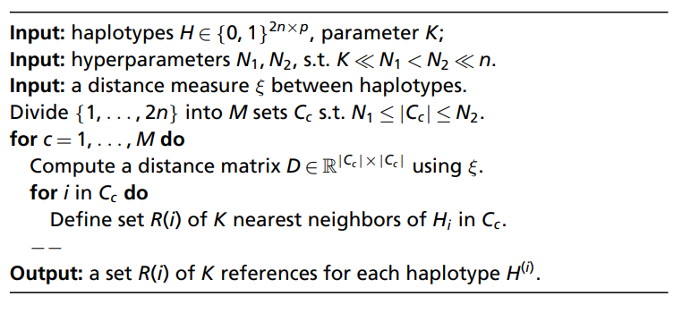

# Genome-wide Association Study (GWAS)

Note that most of this information is being pulled from the following paper: <https://www.pnas.org/content/118/40/e2105841118>

## How GWAS is supposed to work

*GWAS* is meant to uncover the genetic basis of complex polygenic traits. It does not predict phenotype based on genotype information, but actually identifies the precise genetic variants that impact the phenotype, which help reveal the biological pathway by which the phenotype occurs. Multivariate models allow us to explain a higher fraction of phenotypic variance, to find new loci, and to identify variants that actually have causal effects. The way we measure error is based on the number of falsely discovered genetic loci and a multiplicity adjustment to control for the effects of a large number of variables. False discovery rate (FDR) is important to control. We expect that amongst many hundreds or thousands of true discoveries, we will have a few false discoveries.

# Challenges of GWAS

## FDR Control

The simplest polygenic model is one that describes phenotype as the result of additive genetic effects, which suggests a linear regression analysis. However, because of there being hundreds of thousands of explanatory variables, the classical linear regression is not a useful method. Penalized regression and Bayesian models have their own shortcomings, and sample splitting results in loss of power AND does not guarantee FDR control.

## Linkage Disequilibrium

Linkage disequilibrium (LD) is the result of strong local dependence between SNPs on the same chromosome. SNPs are chosen to "cover" the genome, and while the actual causal variants might not be observed, the data on the closest SNPs act as proxy. Genotyping platforms generally rely on closely-spaced SNPs whose alleles are strongly dependent. This causes a problem for variable selection, because the signals are all very similar in multivariate regression models. This makes results harder to interpret, especially in terms of controlling for false discoveries.

## Population Structure

Samples lack independence (individuals share some degree of relatedness), inducing long-range LD across the entire genome. This can lead to flase associations, especially if the sample size is large--even weak associations can appear to be statistically significant.

## GWAS Pipeline

The standard approach is to identify promising signals for the association of a phenotype with one variant at a time via a linear model. Population structure is corrected for with aditional covariates, such as top principal compenents of the genotype matrix. P values are the threshold to control for the familywise error rate (FWER), or the probability of at least 1 false positive when multiple comparisons are being tested, such as Bonferroni corretion and Tukey HSD test. Variants associated with the phenotype and highly correlated with one another are clustered into distinct groups to avoid redundancy.

The results of the univariate tests are then used as input for fine mapping and polygenic risk scores. Fine mapping identifies causal variants among similarly associated SNPs in LD, and polygenic risk scores are predictors of a trait for future samples based on a large number of genetic variants across the genome (I assume this means how many times you predict to find your trait?). This method, however, does not guarantee control over type-I errors, and results are difficult to interpret and actual causal variants hard to find.

# KnockoffGWAS

## Knockoffs

Knockoffs are randomly generated negative control variables that are indistinguishable from the original null variables (not directly associated with the phenotype). Because they are interchangeable, we can find variants that actually influence the phenotype because their association with the phenotype will be significantly stronger than those of their knockoffs. A knockoff filter is an algorithm that computes the knockoff-based significance threshold, which controls FDR--this filter can be applied to any association statistics. For the knockoff filter, a a model for the distribution of the original variables is needed.

## Knockoff Methodology

### Notation, Problem Statement, Assumptions

We want to find variants or groups of variants that contain distinct associations with our phenotype. We want to know if the conditional distribution of our phenotype (Y) given our genotypic information (X) is dependent on a variant of X or a fixed group of variants. In this paper, they focused on one genotype partition assumed to be fixed and all SNPs physically contiguous.

Null hypothesis: can only be true if genotypic information provides no further information about the phenotype beyond what can be gathered from the rest of the genome. This equation essentially allows for the discovery of interesting biological effects rather than any association.

This model is Fisherian in that it attempts to measure the amount of information that an observable random variable X carries about an unknown parametere of a distribution that models X. They do not posit a linear model because they do not know if it is realistic. Phenotypes in different families are assumed to be conditionally independent of one another given genotypes, but those in the same family might be affected by shared environmental factors. Generally, they focus on genotypes with well-understood inheritance mechanisms; the distribution of all genotypes within the same family are described with hidden Markov models (HMMs) that take into account patterns of relatedness and idividual ancestry that have been observed. These HMMs are also assumed to be conditionally independent across different families given reconstructed ancestries of all individuals which are leveraged to create knockoffs, or our negative controls.

### Exchangeable Negative Controls

A random matrix X\~ is a knockoff of X, the genotype, if it satisfies two properties: x\~ provides no additional information about Y, the phenotype (always true since X\~ is made looking at X, not Y), and the joint distribution of X and X\~ must be invariant upon swapping genotypes with their corresponding knockoffs for all individuals in any family. In other words, if we see an unordered pair of genotypes and genotype knockoffs, we have no way of knowing which are the originals and which are the knockoffs. The only difference is when we look at the symmetry between these knockoffs and the originals conditional on Y.

Knockoffs cannot necessarily have the same distribution as originals, but rather they have to preserve short and long-range LD that are consistent in ancestries and family structures. PCA performed on both genotypes and their knockoffs should produce similar results by design.

(add more HMM stuff in here when you've watched Ian's HMM lecture)

### The Knockoff Filter

The only way to tell knockoffs and genotypes apart is to look at the phenotype, statistically speaking. A difference in comparison of Y with either XG or XG\~ provides evidence against the null hypothesis! To do this, we estimate a test statistic that combines importance measures (denoted by T) for each group of SNPs and knockoffs, respectively: Wg = Tg - Tg\~. A large value of Wg \> 0 is evidence against a null hypothesis.

The knockoff filter captures adaptive significance threshold for the test statistics, cortrolling FDR if the knockoffs are correctly exchangeable. Significance of individual findings can also be found through a q value (smallest nominal FDR at which that discovery could have been reported) or local estimate of false discovery proportion (FDP).

#### Resolution

The knockoff filter gets applied at multiple resolutions. Larger resolutions are more "powerful" but are less informative, for instance. FDR is controlled separately for each resolution; it should also be possible to coordinate results at different resolutions to ensure they are consistent to each other and maintain FDR.

### Imputed Variants

Not included in this pipeline (usually a part of fine mapping) because you could never conclude that an unseen variant is causal based on the data alone and would be a source of confounding.

### Leveraging Covariates

Other traits and additional information can be leveraged in this model to compute more powerful statistics, for instance sex, age, top 5 genetic PCs. They help explain some phenotypic variation that can't be captured in the sparse linear combination of genotypes, and actually reduces noise. This is acceptable because while some of these traits are independent of genotypes, the knockoffs already account for principal components that are related to genotype.

# Discussion

**KnockoffGWAS constructs negative control genomes that preserve pre-existing population structure, familiar relatedness, and linkage disequilibrium while allowing for greater control over false discovery rate (FDR).**

Compared to the traditional GWAS pipeline, it is possible to locate causal variants without further fine mapping, etc. Typically GWAS data that comes from different populations are combined in later meta analyses to preserve population structure, but KOGWAS removes the need for this kind of splitting. **Power is increased because LD patterns uncover causal variants better.** Phenotypic variation in minority populations may also benefit from this pipeline.

Including individuals with diverse ancestries makes for more interesting research opportunities! We can investigate which discoveries are consistently found in different populations (better weed out false positives), and look for rare variants.

# Materials and Methods

## Algorithm 1: Choosing the HMM reference haplotypes 

## Algorithm 2: Knockoffs preserving population structure

## Algorithm 3: Knockoffs presering population structure and relatedness

